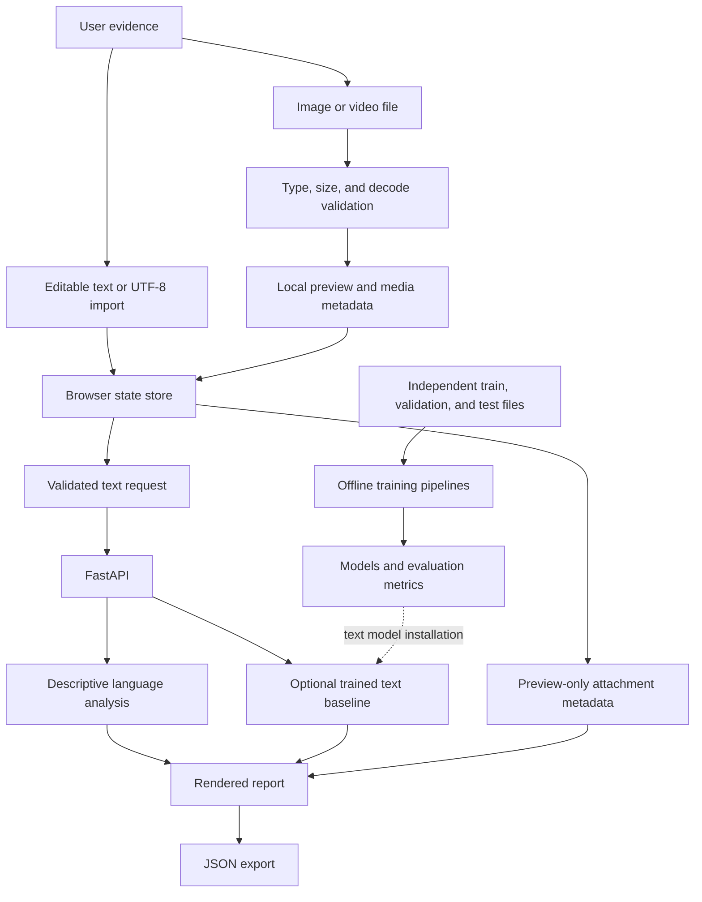

<div align="center">

# FakeEdit

### Beyond the headline: an advanced multimodal AI research and web evidence workspace.

Explore text, image, and video evidence through a responsive interface, a Python API, and reproducible machine-learning pipelines.

[](pyproject.toml)
[](frontend/js/)
[](api/index.py)
[](notebooks/)
[](https://fakeddit-multimodal-fakenews.vercel.app)
[](https://github.com/Priyanshuraj0909/Fakeddit-Multimodal-FakeNews/actions/workflows/tests.yml)

**[Live Demo](https://fakeddit-multimodal-fakenews.vercel.app)** · **[API Documentation](https://fakeddit-multimodal-fakenews.vercel.app/docs)** · **[Architecture](docs/ARCHITECTURE.md)** · **[Verification](docs/VERIFICATION.md)**

</div>

## Overview

Misleading content often combines a persuasive headline with an image or video taken out of context. Reviewing one modality in isolation can miss the relationship between the claim and its supporting media.

**FakeEdit brings those inputs into one evidence workspace.** Users can edit a claim, inspect local image and video previews, examine observable language signals, and export a structured report. Behind the interface, separate training pipelines support a text-classification baseline and multimodal classification from aligned image/text embeddings.

The project extends seven Fakeddit research notebooks into a modular web application with explicit state management, validated API boundaries, cancellation-aware requests, and automated verification. It demonstrates frontend engineering, Python API development, ML evaluation discipline, and deployment automation in a single repository.

### Capability at a glance

| Capability | Current implementation |
| --- | --- |
| Text analysis | Live API-backed language signals: length, uppercase ratio, emphasis phrases, and punctuation |
| Image handling | Browser-local validation, decoded preview, dimensions, replacement, and removal |
| Video handling | Browser-local validation, playback controls, dimensions, and duration when available |
| Text classification | Available after installing trained text-model artifacts and matching inference dependencies |
| Multimodal ML | Offline XGBoost training from ID-aligned image and text embeddings |
| Image/video authenticity detection | Future work; previews do not perform model inference |

The deployed app runs without model artifacts and returns **descriptive signals, not truth verdicts**. The original project's reported 93.9% accuracy is a historical result that has not been independently reproduced; it is not the accuracy of this web application. See the [project review](PROJECT_REVIEW.md) for the evaluation issues identified in the original experiments.

## Key Features

- **Unified evidence composition:** keep text, one image, and one video together; switch between keyboard-accessible input tabs without losing valid attachments.
- **Editable text and file import:** revise a headline or article, try an example, or import a UTF-8 `.txt` excerpt with a 10,000-character limit.
- **Drag-and-drop media previews:** inspect PNG/JPEG/WebP images up to 10 MB and browser-supported MP4/WebM videos up to 50 MB. Media bytes stay on the device.
- **Professional responsive interface:** dark/light themes, reusable CSS tokens, minimalist cards, smooth transitions, visible focus states, and reduced-motion support.
- **Reliable asynchronous interactions:** request timeouts, cancellation on evidence changes, stale-response suppression, response-schema validation, and recoverable errors.
- **Managed preview resources:** reject unsupported, empty, oversized, or undecodable files; release object URLs when previews fail, change, or are removed.
- **Portable evidence reports:** export JSON containing analysis results, a timestamp, and preview-only attachment metadata; exclude blob URLs and raw media files.
- **Reproducible ML workflows:** train-only TF-IDF fitting, validation-based model selection/early stopping, separate test evaluation, saved metrics, and post-ID alignment checks.
- **Automated quality checks:** Python regression tests, native Node.js tests, a Chromium browser smoke script, and GitHub Actions on pushes and pull requests.

## Tech Stack

| Layer | Technologies | Engineering role |
| --- | --- | --- |
| **Frontend** | HTML5, JavaScript ES modules, browser File/Blob APIs, AbortController | Accessible workspace, centralized state, local previews, and cancellation-aware requests |
| **Backend** | Python 3.12, FastAPI, Pydantic, Uvicorn | Validated JSON endpoints, optional model inference, static serving, and generated OpenAPI documentation |
| **AI/ML — runnable pipelines** | scikit-learn, TF-IDF, Logistic Regression, XGBoost, NumPy, pandas, joblib | Text baseline, embedding fusion, evaluation, and artifact persistence |
| **AI/ML — research notebooks** | PyTorch, torchvision, Hugging Face Transformers, RoBERTa, ResNet18, CLIP ViT-B/32 | Historical feature extraction and fusion experiments |
| **Styling** | Native CSS, design tokens, responsive grid, theme variables, media queries | Dark/light styling and responsive layouts without a frontend build framework |
| **Testing** | pytest, FastAPI TestClient, HTTPX, Node.js test runner, agent-browser | API, input-validation, state, training, and browser-flow verification |
| **Deployment & automation** | Vercel Python runtime, GitHub Actions, Git | Production hosting, CI checks, and automatic redeployment from `main` |

Application, training, and historical research dependencies are separated so the deployed explorer does not need to install PyTorch or load CLIP models.

## Architecture & System Flow



1. **Compose:** the browser stores editable text and attachment references in one state store. Image/video files are decoded locally; UTF-8 imports are validated before replacing the text.
2. **Process:** only text is sent to `/api/analyze` or `/api/predict`. The API validates input, computes descriptive indicators, or loads an installed text model.
3. **Render:** the frontend validates the response schema and merges results with local attachment metadata. Editing evidence cancels pending analysis and clears outdated reports.
4. **Export:** JSON reports contain the current results and explicit preview-only media assessments. The application has no database and does not persist submitted text; hosting providers may retain request metadata.
5. **Train separately:** offline pipelines fit models using independent splits. Multimodal training concatenates image/text embeddings only after verifying their IDs and row order.

### API surface

| Method | Endpoint | Purpose |
| --- | --- | --- |
| `GET` | `/api/health` | Service version and model availability |
| `POST` | `/api/analyze` | Descriptive analysis of a `text` payload |
| `POST` | `/api/predict` | Text-model classification; returns `503` if artifacts/dependencies are unavailable |
| `GET` | `/docs` | Interactive OpenAPI documentation |

```bash
curl -X POST http://127.0.0.1:8000/api/analyze \
  -H 'Content-Type: application/json' \
  -d '{"text":"A headline worth examining before sharing."}'
```

### Directory structure

```text
api/                         FastAPI application and optional text inference
fakeddit/                    Text signals and reproducible training pipelines
frontend/
  index.html                 Semantic workspace markup
  css/workspace.css          Theme tokens and responsive styling
  js/app.js                  UI controller and preview lifecycle
  js/api.js                  Requests, cancellation, and response validation
  js/media.js                File validation, decoding, and metadata
  js/state.js                State store and report serialization
tests/
  test_project.py            Backend and training regression tests
  frontend/                  Native Node.js tests
  browser/                   End-to-end browser smoke script
notebooks/                   Seven original Colab research notebooks
results/                     Historical experiment workbook
docs/                        Architecture and verification records
.github/workflows/tests.yml  Automated Python and frontend checks
pyproject.toml               Python requirements and Vercel entrypoint
vercel.json                  Deployment and function packaging configuration
```

## Getting Started / Local Setup

### Prerequisites

- **Python 3.12** for the app and training tools.
- **Node.js 20+ with npm** for frontend checks and optional browser automation.
- **Git** and a modern browser. Video playback requires a browser-supported codec.
- For XGBoost training and Python tests on macOS, install OpenMP with `brew install libomp`.

### 1. Clone the repository

```bash
git clone https://github.com/Priyanshuraj0909/Fakeddit-Multimodal-FakeNews.git
cd Fakeddit-Multimodal-FakeNews
```

### 2. Create an isolated Python environment

**macOS / Linux**

```bash
python3.12 -m venv .venv
source .venv/bin/activate
```

**Windows PowerShell**

```powershell
py -3.12 -m venv .venv
.venv\Scripts\Activate.ps1
```

Install the lightweight application dependencies:

```bash
python -m pip install -r requirements.txt
```

The frontend runs as native browser modules: **no npm install or frontend build is required**.

### 3. Configure the optional model directory

The explorer requires **no API keys or environment variables**. The API defaults to `artifacts/text-baseline` for trained text-model artifacts.

If you have trained artifacts in another directory, set the variable before starting the server:

```bash
# macOS / Linux — optional
export FAKEDDIT_MODEL_DIR="/absolute/path/to/text-baseline"
```

```powershell
# Windows PowerShell — optional
$env:FAKEDDIT_MODEL_DIR = "C:\path\to\text-baseline"
```

The directory must contain `model.joblib` and `metrics.json`. Install inference dependencies matching the training environment. The application reads the process environment directly; it does not automatically load a `.env` file.

### 4. Start the application

```bash
python -m uvicorn api.index:app --reload
```

Open **[localhost:8000](http://127.0.0.1:8000)** and **[localhost:8000/docs](http://127.0.0.1:8000/docs)**. In VS Code, select `.venv` as the Python interpreter; the repository includes Python/Jupyter extension recommendations.

### 5. Run quality checks

```bash
python -m pip install -r requirements-test.txt
python -m pytest -q
npm run check
npm test
```

The current verification record contains **8 Python tests and 8 frontend tests**. They cover request validation, corrupt/missing model artifacts, training outputs, post-ID preservation, embedding alignment, upload limits, UTF-8 decoding, timeouts, and cancellation.

With the server running, verify the user flow in Chromium:

```bash
npx --yes agent-browser --session fakeedit open http://127.0.0.1:8000
npx --yes agent-browser --session fakeedit eval --stdin < tests/browser/workspace-smoke.js
```

The browser script exercises text analysis, keyboard tabs, image drag/drop, video preview, invalid uploads, text import, reset, theme switching, and API-error recovery. See [verification details](docs/VERIFICATION.md).

## Reproducible AI/ML Workflows

The original datasets, embeddings, and trained models are not bundled. Obtain the dataset from the [official Fakeddit repository](https://github.com/entitize/Fakeddit) and follow its usage guidance. Use multimodal-only samples when comparing against the original multimodal benchmark.

### Text baseline

```bash
python -m pip install -r requirements-training.txt
python -m fakeddit.train_text \
  --train data/multimodal_train.tsv \
  --validation data/multimodal_validate.tsv \
  --test data/multimodal_test_public.tsv
```

CSV/TSV inputs require `id`, `clean_title`, and `2_way_label`, with both binary classes. The pipeline rejects missing values, duplicate IDs, and overlapping post IDs across splits. It fits TF-IDF on training data, selects logistic-regression regularization on validation data, and evaluates the selected model on test data.

Output: `artifacts/text-baseline/model.joblib` and `metrics.json`. Restart the API after installing artifacts. Classes are presented as dataset classes `0` and `1`; they do not constitute independent fact verification.

### Multimodal embedding fusion

Each split directory requires `posts.csv` with the same columns, plus `image.npz` and `text.npz`. Each NPZ must contain string `ids` and finite, nonempty, two-dimensional numeric `embeddings`. Embedding IDs must match the CSV row order exactly, and all splits must use the same encoders and preprocessing.

```bash
python -m fakeddit.train_multimodal \
  --train data/embeddings/train \
  --validation data/embeddings/validation \
  --test data/embeddings/test
```

The CPU-compatible XGBoost pipeline uses validation data for early stopping and writes `artifacts/multimodal/model.json` and test metrics. Author/subreddit metadata is omitted to reduce source shortcuts. This workflow trains from existing embeddings; it does not implement hosted multimodal inference.

For historical notebook experiments, install `requirements-local.txt`. Original Colab/Drive paths and some CUDA assumptions remain in those notebooks. Only load trusted joblib artifacts, and save the training environment alongside generated models:

```bash
python -m pip freeze > artifacts/text-baseline/environment.txt
```

Synthetic test fixtures validate software behavior only; they are not benchmark evidence or a shipped classifier.

## Deployment & Engineering Decisions

The [production app](https://fakeddit-multimodal-fakenews.vercel.app) is hosted on Vercel and connected to this repository's `main` branch. `pyproject.toml` declares `api.index:app`; `vercel.json` configures FastAPI deployment and excludes datasets, tests, historical results, and notebooks from the function bundle. GitHub Actions checks Python and frontend code on every push and pull request; Vercel automatically redeploys changes to `main`.

| Decision | Why it matters |
| --- | --- |
| Native ES modules and CSS | Keeps the application build-free and makes its module boundaries easy to inspect |
| Browser-local media previews | Avoids transmitting image/video bytes for a task that does not require server-side inference |
| Independent ML evaluation splits | Prevents validation-based model selection from directly using the final test set |
| ID-aligned embedding inputs | Detects mismatched modality rows before fusion and training |
| Cancellation and object-URL cleanup | Prevents outdated reports and releases resources during media replacement |
| Separate dependency groups | Keeps lightweight hosting independent of heavyweight research tooling |

`data/`, `artifacts/`, virtual environments, and secrets are ignored by Git. Hosting a trained classifier additionally requires verified artifacts and matching inference dependencies; CLIP inference may need a separate compute service.

## Future Scope / Optimizations

- **Complete the inference path:** reproduce real-data results, version encoders and preprocessing, and expose image/text classification through a dedicated inference service.
- **Extend video research:** evaluate frame sampling, temporal representations, and text/video alignment using an appropriate labeled dataset before claiming video-detection accuracy.
- **Improve evaluation:** add author-disjoint testing, near-duplicate detection, metadata ablations, calibration, and confidence intervals.
- **Measure and tune performance:** establish latency/memory baselines; benchmark worker-based media preprocessing, inference batching, and caching of repeated feature extraction.
- **Scale deployment:** separate the web/API layer from GPU workloads, add bounded job queues, and define retention/access controls if persistent uploads are introduced.
- **Strengthen operations:** add dependency locking, browser checks in CI, runtime monitoring, and a versioned model release process.
- **Expand accessibility and reporting:** audit contrast and assistive-technology behavior, add richer evidence annotations, and support additional export formats.

## Author & Research Acknowledgment

**[Priyanshu Raj](https://github.com/Priyanshuraj0909)** — project owner.

Built around the Fakeddit multimodal benchmark by Kai Nakamura, Sharon Levy, and William Yang Wang. Dataset access and usage guidance are maintained in the [upstream repository](https://github.com/entitize/Fakeddit). The original notebooks and results workbook remain available as research provenance.
